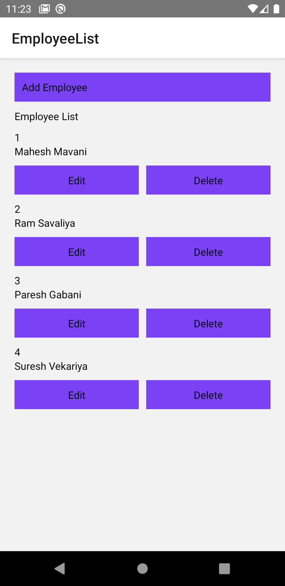

# employee_crud_hooks

 How to implement CRUD operations with using Hooks
 

 In this tutorial, we'll make a simple CRUD app that can add, update, or delete employee using hooks.
  

 

    
                                          

